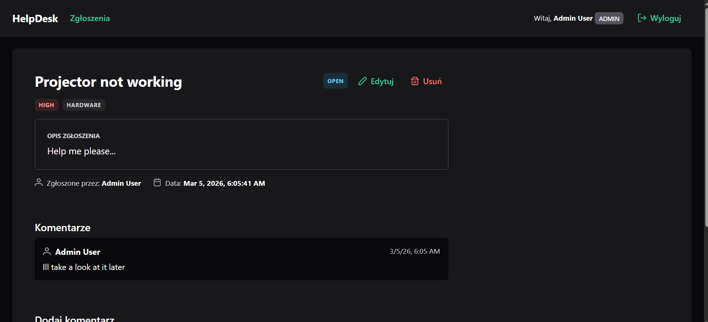

# Helpdesk Ticket System

A full-stack helpdesk application built as a university project and portfolio piece.

The app allows users to log in, create support tickets, and track their status. Admin users can see all tickets and manage support workflow.

## Screenshot



## Tech Stack

- Frontend: Angular 20, TypeScript, SCSS
- Backend: Node.js, Express, json-server
- Auth: JWT (role-based access)
- Tooling: ESLint, Stylelint
- Containers: Docker, Docker Compose

## Features

- JWT authentication with user roles (`user`, `admin`, `support`)
- Ticket list and ticket details view
- Create new tickets with category and priority
- Comments in ticket details
- Route guards and auth interceptor on frontend
- Docker setup for fast local run

## Quick Start (Docker)

```bash
docker-compose up --build
```

- Frontend: `http://localhost`
- Backend API: `http://localhost:3000`

## Quick Start (Local Dev)

1. Start backend:

```bash
cd backend
npm install
npm start
```

2. Start frontend (new terminal):

```bash
cd frontend/helpdesk-frontend
npm install
npm start
```

- Frontend: `http://localhost:4200`
- Backend API: `http://localhost:3000`

## Demo Accounts

- Admin: `admin@example.com` / `admin`
- User: `user@example.com` / `user`
- Support: `support@example.com` / `support`

## Project Structure

- `backend/` - API, auth logic, json database
- `frontend/helpdesk-frontend/` - Angular client app
- `docker-compose.yml` - local container orchestration

## What I Practiced In This Project

- Building a complete Angular + Node.js application
- Implementing authentication and role-based authorization
- Designing API communication with interceptors and services
- Working with Docker in a multi-container setup

## Future Improvements

- Better validation and error handling
- Unit and integration tests
- Better UI/UX polish and accessibility
- CI pipeline for automated checks

## Author

Student project for portfolio purposes.
